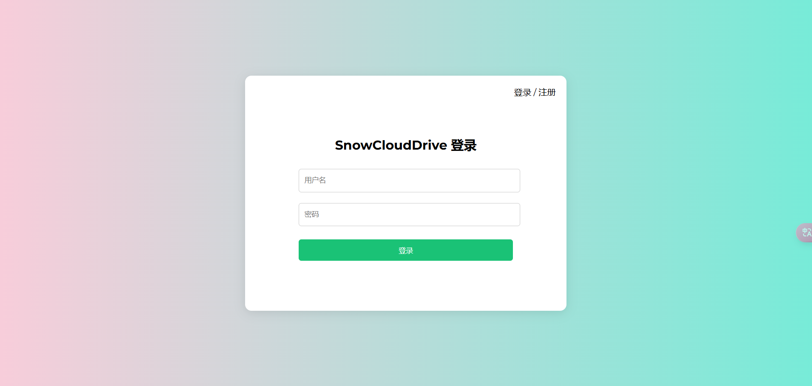
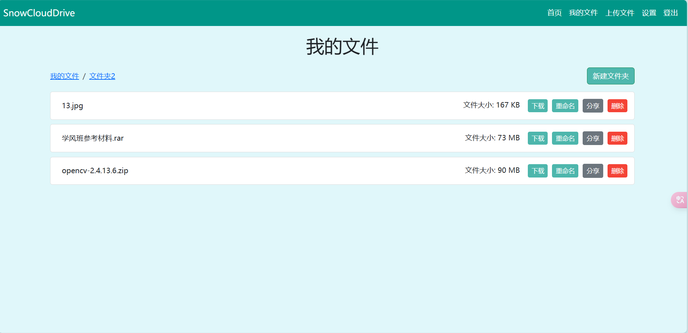

# SnowCLoudDrive

本项目为 Java EE 主流框架的课程作业，仅做springboot学习使用。

该简易网盘系统，实现了登录注册、文件（夹）的各种操作，完成了文件分享链接的功能，以及文件夹打开、适配面包屑导航栏的功能。

### 开发环境

- springboot 3.3.5
- springSecurity 6.3.4
- IntelliJ IDEA 2024.1 (Ultimate Edition)

### 技术栈

- SpringBoot (spring, springMVC)
- SpringSecurity
- MyBatis-Plus
- MySQL
- Thymeleaf
- Bootstrap5
- commons-fileupload
- Lombok
- validation

### 系统存在问题：

- 该系统在上传小文件时能做到快速，因限制了用户上传文件的大小，故在测试时并未发现问题，但是临近上交报告，再次测试了大文件的上传发现了系统卡顿的问题，修复建议：1.做进度条等待。2.学习文件秒传原理，以及实现。

- 在写完整个项目后，回看项目结构有一些缺陷，刚开始设计文件和文件夹类时考虑组合关系，让文件夹包含一个属性文件列表，但是在编写转换器时出现问题，导致未能实现，改用如今的存双id的形式。
- 项目出现安全性问题，这里采用的文件链接分享应当附上验证码，考虑写入文件类中，在分享链接时加上验证码，否则会出现以及登录的用户可以通过修改链接下载到所有用户下的任意文件，因课程作业需求，将另寻事件修改。

该项目可以融入很多功能复杂的系统之中，考虑使用领域驱动设计模式(DDD)代替MVC，改为微服务中的一小块服务。当前的项目架构会出现腐化的情况，一些service和management会出现调用紊乱的情况，编写代码应当加强架构意识。考虑将鉴权移出当前系统，作为一个大系统的鉴权系统，并修改采用RBAC权限管理模式，考虑采用单点登录模式。文件（夹）的相关功能单独划为一个微服务。本次实验采用springboot+thymeleaf编写，后续考虑更换技术框架，完善当前项目，尝试采用springcloud+vue进行设计整合进其他项目之中。

### 系统界面：






### 项目运行

1. 克隆仓库

```cmd
git clone https://github.com/zhifengmuxue/SnowCloudDrive.git
```

2. 运行SnowCloudDriveApplication

```
mvn spring-boot:run
```

